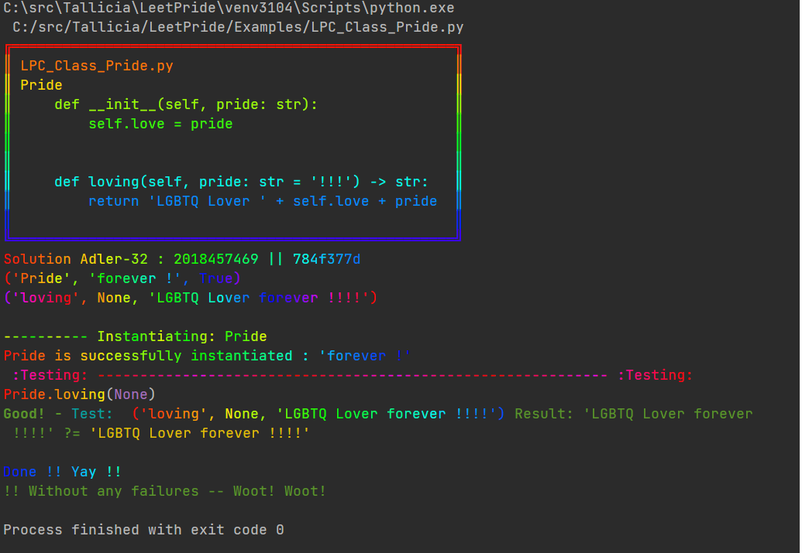

<h1 style = font-size:80px>
<div style="text-align: center;">
<span style="color:purple">L</span>
<span style="color:violet">e</span>
<span style="color:blue">e</span>
<span style="color:green">t</span>
<span style="color:yellow">P</span>
<span style="color:orange">r</span>
<span style="color:orange">i</span>
<span style="color:red">d</span>
<span style="color:violet">e</span>
</div>
</h1>
<center>
💜 💙 🍏 💚 💛 📙 🍎
</center>

# To make algorithm and data structure learning more exciting, colorful and enjoyable.

LeetPride interrogates the created classes and 
runs the tests specified to ensure success and optimize focus on problem-solving maximizing 
data structure an algorithm absorption, groking and satisfaction.

><h3>One time Setup</h3>
>>simply install with 
```pip install LeetPride```

Screenshot of the 4 simple steps running in seconds.


>><h3>Happy Problem Solving and Happy Pride !!</h3>
> 
>>Quickly get going on given any problem by simply creating a py file to 
> begin coding solutions starting with import then common python boilerplate for 
> generating and running tests on solutions.
>>
>>
> 
>>There are 4 basic simple setups to get going in seconds. The last is the code you will 
> write and generally goes first, followed by generate_tests() and then the 
> main boilierplate runners. 
> Also, there are capabilities to easily 
test and time multiple method implementations and different class method call sequencing for
class testing. 

<ol>
<li>

    from LeetPride import run_process
</li>

<li>

>> The standard main for running Class and Method solution tests is as follows:

    def main() -> int:
        return run_process(generate_tests())
    
    
    if __name__ == '__main__':
        exit(main())
</li>

<li>

>>[Multiple examples can be found in the /Examples folder of test generation simplicity and support for
> complex cases.](LP_Examples)
>
[Online gist example with screenshot of results for Daily LeetCode](https://gist.github.com/Tallicia/dcbfc28ee34b0685a88ad1bd07f90830)
>
>>Example of required generate_tests() method using separate tests and
expected results zipped together: 

 
    def generate_tests():
        tests = (['Pride', 'loving', ],
                 [None,
                  'forever',
                  ])
        expected_test_results = [True, 'LGBTQ Lover forever !!!!', ]
        return list(zip(tests[0], tests[1], expected_test_results))
</li>

<h2>For either -method- or -class- solutions:</h2>
<li>

> >
>><ul>
>>A or B ( but supports mixing too even. )
>A. Class - class questions generally entail verifying output of sequenced method calls:
>
>

    class Pride:
        def __init__(self, always: bool = True):
            self.love = always
    
        def loving(self, equality: str = 'forever more') -> bool:
            return 'LGBTQ Lover ' + equality + ' !!!!' if self.love else 'Send Love'
></ul>
><ul>
>B. Method - general class Solution, so to align with LC practices:
>
>


    class Solution:
        # @timeit
        def method1(self, nums: List[int], target: int) -> List[int | None]:
            return [nums[target]]
</ul>
</li>

</ol>

>> All together for reference example:
> 
> ```pip install LeetPride```
 

    from LeetPride import run_process
    
    
    class Pride:
        def __init__(self, always: bool = True):
            self.love = always
    
        def loving(self, equality: str = 'forever more') -> bool:
            return 'LGBTQ Lover ' + equality + ' !!!!' if self.love else 'Send Love'
    
    
    def generate_tests():
        tests = (['Pride', 'loving', ],
                 [None,
                  'forever',
                  ])
        expected_test_results = [True, 'LGBTQ Lover forever !!!!', ]
        return list(zip(tests[0], tests[1], expected_test_results))
    
    
    def main() -> int:
        return run_process(generate_tests())
    
    
    if __name__ == '__main__':
        exit(main())


# A few notes:
Instantiating the LeetCodeCore object takes an optional time_all bool parameter.
-- If enabled to True, this will dynamically wrap any non @timeit wrapped methods
designated for testing with a @timeit decorator and provide timing
duration information detail.

Graphies and Linkies helper methods for easy test setup and printout of
representations of node graphs, trees, and linked lists 
are being cleaned up and will be included in very near term update.

Enjoy!
<br>
Tallicia


>
>[LeetPride depends on modules listed in requirements.txt](requirements.txt)
>
>It is recommended to create a venv and install requirements.
>>
>>```
>>    python3 -m venv venv
>>    ./venv/scripts/activate
>>    python3 -m pip install -U pip
>>    python3 -m pip install -r requirements.txt 
>>

>> PURPLE HEART (&#x1F49C;): 💜
BLUE HEART (&#x1F499;): 💙
GREEN APPLE (&#x1F34F;): 🍏
GREEN HEART (&#x1F49A;): 💚
YELLOW HEART (&#x1F49B;): 💛
ORANGE BOOK (&#x1F4D9;): 📙
RED APPLE (&#x1F34E;): 🍎
GREEN BOOK (&#x1F4D7;): 📗
BLUE BOOK (&#x1F4D8;): 📘
LARGE RED CIRCLE (&#x1F534;): 🔴

<center>
💜 💙 🍏 💚 💛 📙 🍎
</center>
<h1 style = font-size:80px>
<div style="text-align: center;">
<span style="color:purple">L</span>
<span style="color:violet">e</span>
<span style="color:blue">e</span>
<span style="color:green">t</span>
<span style="color:yellow">P</span>
<span style="color:orange">r</span>
<span style="color:orange">i</span>
<span style="color:red">d</span>
<span style="color:violet">e</span>
</div>
</h1>
